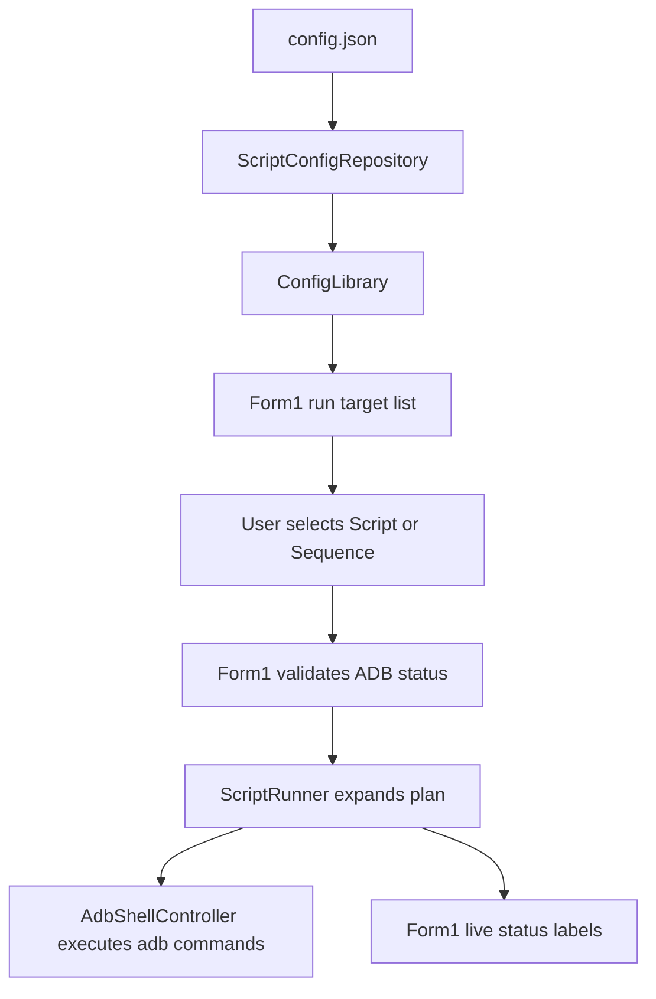
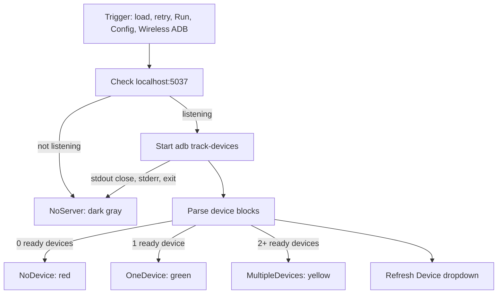
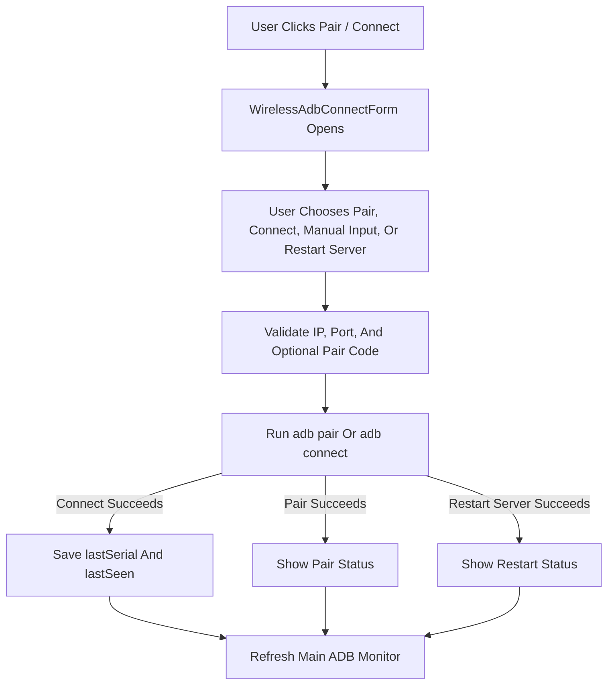
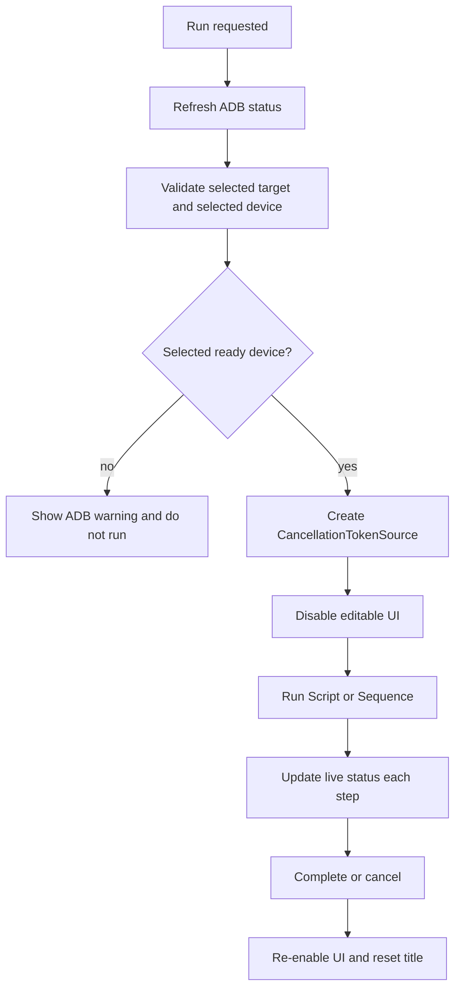

# Architecture

## Module Map

### `Program.cs`

Application entry point. It initializes logging, configures global exception handlers, initializes WinForms, and opens `Form1`.

### `Form1.cs`

Main window and runtime coordinator.

Responsibilities:

- Load and reload configuration.
- Build the Script/Sequence run target list.
- Apply tag filtering.
- Apply default offsets.
- Register and unregister global hotkeys.
- Route Run, Stop, Escape, and hotkey actions.
- Own run cancellation state.
- Own live run status labels.
- Own taskbar overlay icons.
- Own ADB status monitor state.
- Own current ADB device dropdown state.
- Open `ConfigEditorForm`.
- Open `WirelessAdbConnectForm`.

### `Form1.Designer.cs`

Designer-managed main-window controls. Keep layout edits compatible with WinForms designer expectations.

### `ConfigEditorForm.cs`

Hand-built config editor for:

- Settings
- Devices
- Offset profiles
- Scripts
- Sequences

The editor works in memory while open. It writes `config.json` only on explicit save, confirmed close-save, or restore.

It also owns the shared Script/Sequence `Track Touch` toggle.

### `WirelessAdbConnectForm.cs`

Hand-built Wireless ADB helper window for manual Pair, Connect, and ADB server restart flows. It uses saved `settings.devices` entries for friendly device choices, supports Manual Input, validates IPv4 address segments and numeric ports/pairing codes, runs `adb pair` or `adb connect`, can restart the ADB server with `adb kill-server` plus `adb start-server`, and updates saved Wi-Fi device `lastSerial`/`lastSeen` after a successful Connect.

### `SearchableDropdown.cs`

Custom main Script/Sequence picker. The popup owns search text and clears it on close. The main field displays only the selected item. When opened, the popup highlights the current selected item if it is present in the current filtered list.

### `ScriptConfigRespository.cs`

Configuration repository. It loads, migrates, normalizes, and saves `config.json`.

Important: the filename currently contains `Respository`, not `Repository`. Rename only as a deliberate refactor.

### `ScriptModel.cs`

In-memory config models:

- `ConfigLibrary`
- `ScriptModel`
- `ActionGroup`
- `SequenceModel`
- `SequenceItem`
- `StepAction`

### `ScriptRunner.cs`

Runtime planner and executor. It expands Scripts and Sequences into planned ADB commands, applies random sleeps, applies offsets, updates live status, and respects cancellation.

### `AdbShellController.cs`

ADB command wrapper. It shells out to `C:\adb\adb.exe` by default and works in physical device pixels.

It exposes captured Pair, Connect, Kill Server, and Start Server helpers for Wireless ADB UI flows so success/failure output can be shown in the dialog.

### `HotKeyManager.cs`

Global hotkey parser, registration, unregistration, and `WM_HOTKEY` routing.

### `OffsetDisplayOption.cs`

Main offset dropdown values and labels.

### `MouseHelper.cs`

Coordinate randomization helper.

### `AppLogger.cs`

Daily file logger under `AppContext.BaseDirectory\logs`. It deletes logs older than 7 days at startup.

## Runtime Data Flow

## ADB Status Flow

## Wireless ADB Flow

## Run Flow

