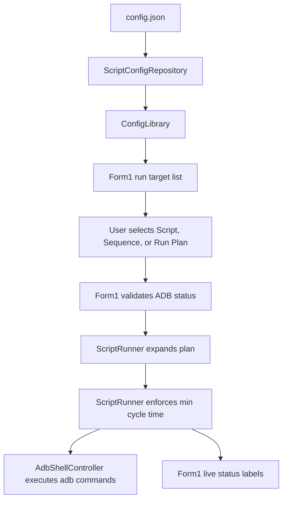
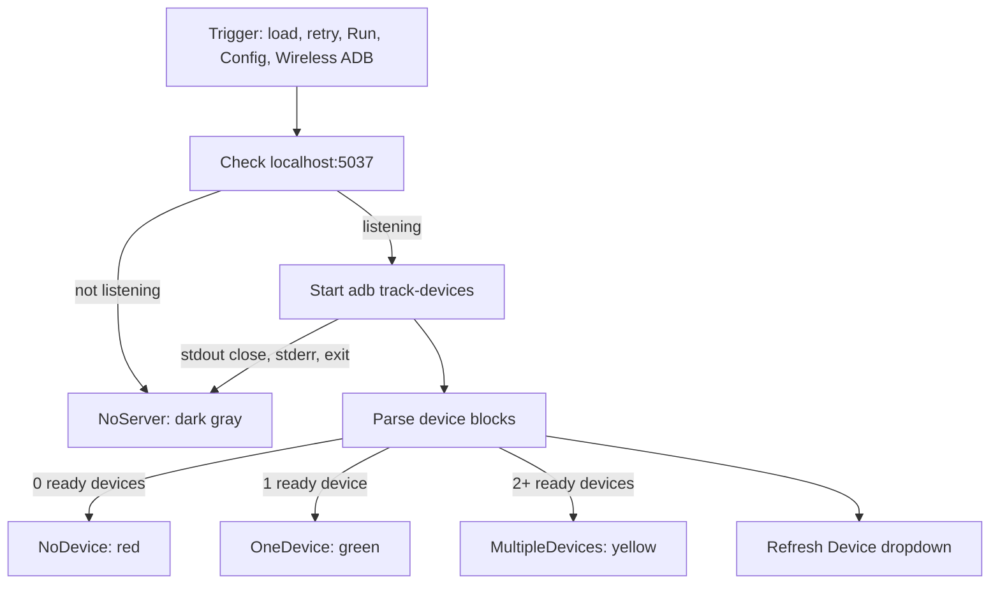
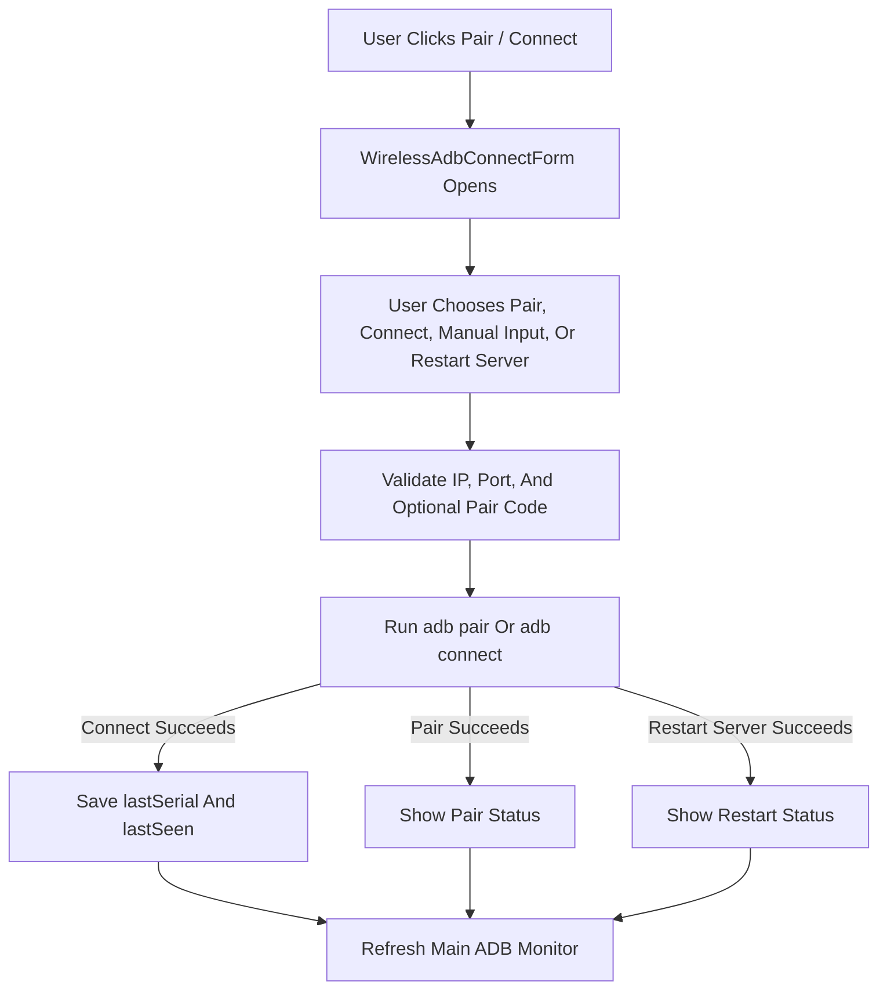
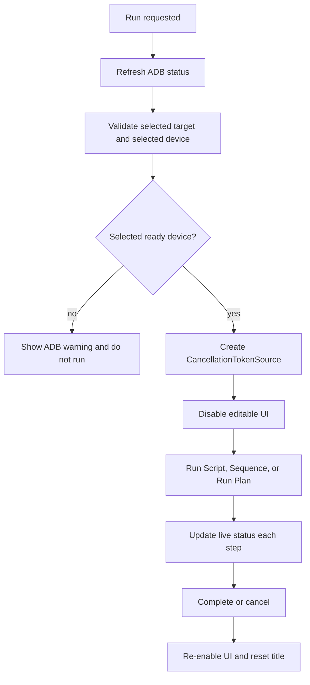

# Architecture

## Module Map

### `Program.cs`

Application entry point. It initializes logging, configures global exception handlers, initializes WinForms, and opens `Form1`.

### `Form1.cs`

Main window and runtime coordinator.

Responsibilities:

- Load and reload configuration.
- Build the Script/Sequence/Run Plan target list.
- Apply tag filtering.
- Apply default offsets.
- Register and unregister primary Set 1 and secondary Set 2 global hotkeys.
- Route Run, Stop, Escape, and hotkey actions.
- Own independent run-slot cancellation state for Set 1 and Set 2.
- Own live run status labels for each visible run set.
- Own fixed one-set/two-set client-area sizing with user resize and maximize disabled.
- Own taskbar overlay icons for hotkey registration status plus Set 1/Set 2 run identifiers.
- Own ADB status monitor state.
- Own current ADB device dropdown state for each run set and prevent both visible/running sets from selecting the same device.
- Open `ConfigEditorForm`.
- Open `WirelessAdbConnectForm`.

### `Form1.Designer.cs`

Designer-managed main-window controls. Keep layout edits compatible with WinForms designer expectations.

The current main window shell is intentionally small: it hosts `mainLayout`, while the repeated run-set UI lives in `RunSetControl`. `Form1.cs` creates two `RunSetControl` instances and switches fixed one-set/two-set client sizes. The outer form size is derived with `SizeFromClientSize(...)` so DPI-dependent window chrome can vary without changing the usable layout area.

### `RunSetControl.cs`

Designer-backed `UserControl` for one main-window run set. Set 1 and Set 2 both use this same control. Set 1 shows the hotkey/ADB dots plus Config and Pair / Connect; Set 2 hides those shared controls.

`RunSetControl.cs` also applies the stable runtime layout after `InitializeComponent()`. This is deliberate: Visual Studio 2026 rewrote some designer values during the UI work, including autoscale metadata, combo heights, status rows, and offset items. Runtime layout setup keeps the compact layout from being lost if the designer file is opened. The action column uses fixed rows plus an explicit bottom spacer row so spare height does not stretch the Pair / Connect button.

### `RunSetControl.Designer.cs`

Designer-managed controls for one run set. Keep status labels as explicit designer fields. Do not replace them with helper-created controls inside the designer file; the WinForms designer may strip those from `InitializeComponent()`.

The designer should not own runtime data population such as `OffsetDisplayOption.All`. Populate those values in behavior code so designer regeneration cannot leave the Offset dropdown blank.

### `ConfigEditorForm.cs`

Hand-built config editor for:

- Settings
- Devices
- Offset profiles
- Scripts
- Sequences
- Run Plans

The editor works in memory while open. It writes `config.json` only on explicit save, confirmed close-save, or restore. Pressing `Esc` calls the same close flow as the Close button.

It also owns the shared Script/Sequence `Track Touch` toggle.

### `WirelessAdbConnectForm.cs`

Hand-built Wireless ADB helper window for manual Pair, Connect, and ADB server restart flows. It uses saved `settings.devices` entries for friendly device choices, supports Manual Input, validates IPv4 address segments and numeric ports/pairing codes, runs `adb pair` or `adb connect`, can restart the ADB server with `adb kill-server` plus `adb start-server`, updates saved Wi-Fi device `lastSerial`/`lastSeen` after a successful Connect, and closes on `Esc`.

### `SearchableDropdown.cs`

Custom main Script/Sequence/Run Plan picker. The popup owns search text and clears it on close. The main field displays only the selected item. When opened, the popup highlights the current selected item if it is present in the current filtered list.

### `ScriptConfigRespository.cs`

Configuration repository. It loads, migrates, normalizes, and saves `config.json`.

Important: the filename currently contains `Respository`, not `Repository`. Rename only as a deliberate refactor.

### `ScriptModel.cs`

In-memory config models:

- `ConfigLibrary`
- `ScriptModel`
- `ActionGroup`
- `SequenceModel`
- `SequenceItem`
- `RunPlanModel`
- `RunPlanItem`
- `StepAction`

### `ScriptRunner.cs`

Runtime planner and executor. It expands Scripts, Sequences, and Run Plans into planned ADB commands, applies random sleeps, enforces optional minimum cycle time, applies offsets, updates live status, and respects cancellation.

### `AdbShellController.cs`

ADB command wrapper. It shells out to `C:\adb\adb.exe` by default and works in physical device pixels.

It exposes captured Pair, Connect, Kill Server, and Start Server helpers for Wireless ADB UI flows so success/failure output can be shown in the dialog.

### `HotKeyManager.cs`

Global hotkey parser, primary/secondary registration, unregistration, and `WM_HOTKEY` routing. Primary hotkeys control Set 1. Secondary/backup hotkeys control Set 2 and are registered only while Set 2 is open. It reports whether primary and secondary registrations succeeded so the main hotkey dot can show gold, green, blue, or red.

### `OffsetDisplayOption.cs`

Main offset dropdown values and labels.

### `MouseHelper.cs`

Coordinate randomization helper.

### `AppLogger.cs`

Daily file logger under `AppContext.BaseDirectory\logs`. It deletes logs older than 7 days at startup.

## Runtime Data Flow

## ADB Status Flow

## Wireless ADB Flow

## Run Flow

